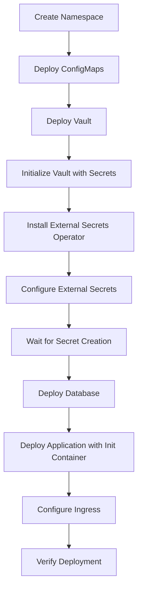

# Kubernetes Directory Structure

This document explains the complete Kubernetes deployment structure for the Bournemouth University IT Student API.

## 📁 Directory Layout

```
k8s/
├── namespaces/
│   └── namespace.yml              # Creates 'student-api' namespace
├── app/
│   └── application.yml            # Complete application deployment
├── db/
│   └── database.yml               # Complete PostgreSQL deployment
├── vault/
│   └── vault-deployment.yml       # HashiCorp Vault deployment
├── eso/
│   └── external-secret.yml        # External Secrets Operator config
├── configmaps/
│   └── app-configmap.yml          # Non-sensitive configuration
├── secrets/
│   └── db-secret.yml              # Reference for ESO-managed secrets
├── ingress/
│   └── student-api-ingress.yml    # External access configuration
├── deploy-all.sh                  # Linux/Mac deployment script
├── deploy-all.bat                 # Windows deployment script
├── README-K8S.md                  # Comprehensive deployment guide
└── STRUCTURE.md                   # This file
```

## 🔧 Component Details

### Namespace (`namespaces/namespace.yml`)
- **Purpose**: Isolates all resources in `student-api` namespace
- **Resources**: 1 Namespace

### ConfigMaps (`configmaps/app-configmap.yml`)
- **Purpose**: Stores non-sensitive configuration
- **Contains**: DB_HOST, DB_PORT, DB_NAME, DB_SSL_MODE, SERVER_PORT
- **Resources**: 1 ConfigMap

### HashiCorp Vault (`vault/vault-deployment.yml`)
- **Purpose**: Secure secret storage and management
- **Mode**: Development (for demo purposes)
- **Resources**: 1 Deployment, 1 Service, 1 Job (initialization)
- **Secrets Stored**: Database username and password

### External Secrets Operator (`eso/external-secret.yml`)
- **Purpose**: Syncs secrets from Vault to Kubernetes
- **Resources**: 1 SecretStore, 1 ExternalSecret, 1 Secret (vault token)
- **Sync Interval**: 15 seconds

### Database (`db/database.yml`)
- **Purpose**: PostgreSQL database for student data
- **Resources**: 1 Deployment, 1 Service, 1 ConfigMap, 1 PVC
- **Storage**: 1Gi persistent volume
- **Image**: postgres:15-alpine

### Application (`app/application.yml`)
- **Purpose**: Student API REST service
- **Resources**: 1 Deployment (with init container), 2 Services
- **Replicas**: 2 for high availability
- **Init Container**: Runs database migrations
- **Services**: ClusterIP and LoadBalancer

### Ingress (`ingress/student-api-ingress.yml`)
- **Purpose**: External HTTP access to the API
- **Resources**: 1 Ingress
- **Controller**: nginx-ingress

### Secrets (`secrets/db-secret.yml`)
- **Purpose**: Reference documentation only
- **Note**: Actual secret created by External Secrets Operator

## 🔄 Deployment Flow



## 🔐 Security Architecture

### Secret Management Flow
1. **Vault Storage**: Database credentials stored in HashiCorp Vault
2. **ESO Sync**: External Secrets Operator pulls secrets from Vault
3. **K8s Secret**: ESO creates native Kubernetes secret
4. **Pod Injection**: Secrets injected as environment variables

### Network Security
- **Internal Communication**: ClusterIP services
- **External Access**: LoadBalancer + Ingress
- **Namespace Isolation**: All resources in dedicated namespace

## 🚀 Init Container Strategy

The application deployment includes an init container that:

1. **Waits for Database**: Uses netcat to check PostgreSQL connectivity
2. **Runs Migrations**: Executes database schema migrations
3. **Validates Setup**: Ensures database is ready before main container starts

```yaml
initContainers:
- name: migration
  image: tenifuzy01/v1:latest
  command:
  - /bin/sh
  - -c
  - |
    echo "Waiting for database to be ready..."
    until nc -z $DB_HOST $DB_PORT; do
      echo "Waiting for PostgreSQL at $DB_HOST:$DB_PORT..."
      sleep 2
    done
    echo "Database is ready, running migrations..."
    /app/main migrate || echo "Migration completed or no changes needed"
```

## 📊 Resource Allocation

### Application Pods
- **Requests**: 128Mi memory, 100m CPU
- **Limits**: 256Mi memory, 200m CPU
- **Replicas**: 2

### Database Pod
- **Requests**: 256Mi memory, 250m CPU
- **Limits**: 512Mi memory, 500m CPU
- **Storage**: 1Gi persistent volume

### Vault Pod
- **Requests**: 128Mi memory, 100m CPU
- **Limits**: 256Mi memory, 200m CPU

### Init Container
- **Requests**: 64Mi memory, 50m CPU
- **Limits**: 128Mi memory, 100m CPU

## 🔍 Health Checks

### Application Probes
- **Liveness**: HTTP GET /healthcheck (30s initial, 10s period)
- **Readiness**: HTTP GET /healthcheck (5s initial, 5s period)
- **Startup**: HTTP GET /healthcheck (10s initial, 5s period, 30 failures)

### Database Probes
- **Liveness**: pg_isready command (30s initial, 10s period)
- **Readiness**: pg_isready command (5s initial, 5s period)

## 🌐 Service Exposure

### Internal Services (ClusterIP)
- **student-api-service**: Port 8080 → Application pods
- **postgres-service**: Port 5432 → Database pod
- **vault-service**: Port 8200 → Vault pod

### External Services
- **student-api-loadbalancer**: LoadBalancer on port 8080
- **student-api-ingress**: HTTP routing via Ingress controller

## 📝 Configuration Management

### Environment Variables Sources
1. **ConfigMap** (`app-config`): Non-sensitive settings
2. **Secret** (`db-secret`): Database credentials from Vault
3. **Direct Values**: Container-specific settings

### Configuration Precedence
1. Direct environment variables (highest)
2. Secret references
3. ConfigMap references (lowest)

## 🔄 Update Strategy

### Rolling Updates
- **Application**: RollingUpdate with 25% max unavailable
- **Database**: Recreate strategy (single replica)
- **Vault**: Recreate strategy (development mode)

### Rollback Capability
```bash
# Check rollout history
kubectl rollout history deployment/student-api -n student-api

# Rollback to previous version
kubectl rollout undo deployment/student-api -n student-api
```

## 🧪 Testing Strategy

### Deployment Validation
1. **Pod Status**: All pods running and ready
2. **Service Endpoints**: Services have active endpoints
3. **Secret Creation**: ESO successfully created secrets
4. **Migration Success**: Init container completed successfully
5. **API Connectivity**: Health check returns 200 OK

### API Testing
```bash
# Health check
curl http://localhost:8080/healthcheck

# List students
curl http://localhost:8080/api/v1/students

# Create student
curl -X POST http://localhost:8080/api/v1/students \
  -H "Content-Type: application/json" \
  -d '{"first_name":"Test","last_name":"User",...}'
```

This structure provides a production-ready, secure, and maintainable Kubernetes deployment for the Student API application.